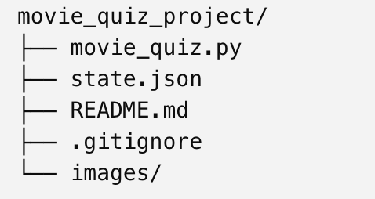
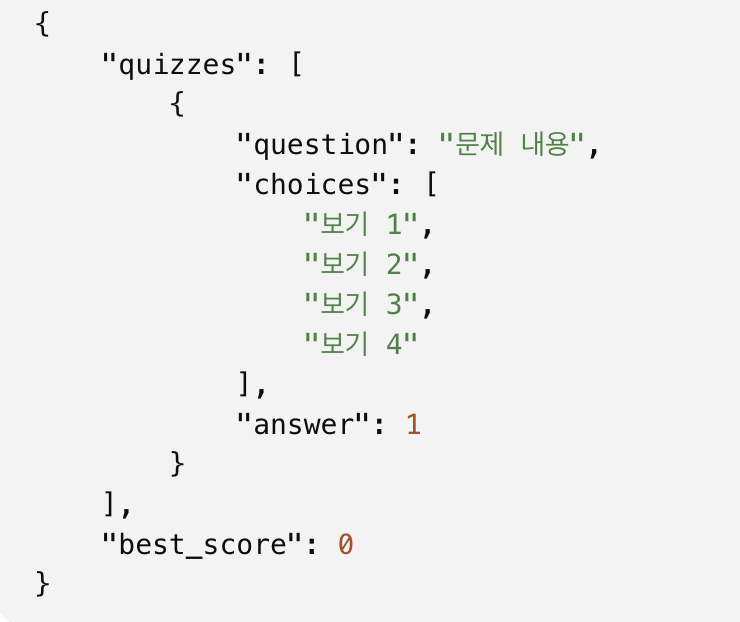
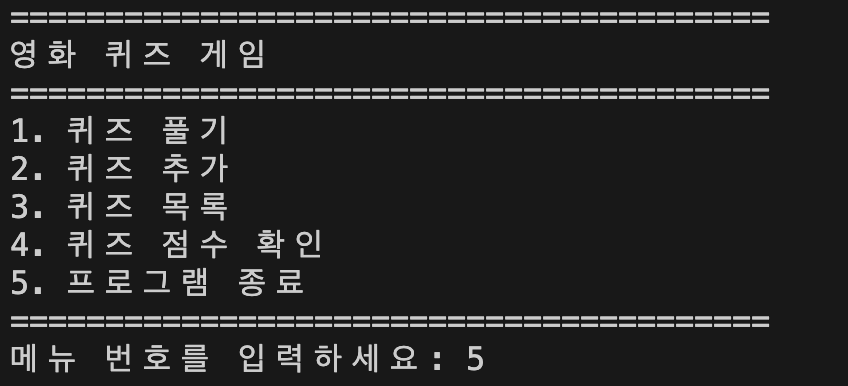

# Movie Quiz Game
## Python으로 간단한 영화 퀴즈 게임 만들기 과제.

## 1. 프로젝트 개요
### 영화에 관한 문제를 풀고, 새로운 문제를 추가하며, 최고 점수를 확인할 수 있는 콘솔 기반 퀴즈 프로그램이다.

## 2. 퀴즈 주제와 선정 이유
### 평소 영화에 관심이 있고, 감독, 배우, 영화제, 히어로 영화 등 여러 분야의 문제를 다양하게 만들 수 있어서 영화라는 주제를 선택.

## 3. 실행 방법
- 터미널에서 프로젝트 폴더로 이동한 뒤 아래 명령어를 실행합니다.
### ```bash
### python3 movie_quiz.py

## 4. 파일 구조와 파일 별 설명
### 1) 파일 구조



### 2) movie_quiz.py
- 영화 퀴즈 게임의 전체 Python 코드가 들어 있고 주요 클래스는 아래와 같다.
#### **Quiz**
- 문제 하나를 관리
- 문제, 선택지, 정답 정보를 저장
- 문제 출력과 정답 확인 기능을 담당
#### **DataManager**
- state.json 파일 저장과 불러오기 기능 수행
#### **QuizGame**
- 메뉴와 게임 전체 기능을 관리
- 퀴즈 풀기, 추가, 목록, 점수 확인 기능 담당
### 3) state.json
- state.json 파일은 프로젝트 루트 폴더에 생성되고, 아래 이미지와 같은 데이터가 저장된다.
#### **quizzes**
- 저장된 퀴즈 목록으로 각 퀴즈는 아래의 정보를 가지고 있다.
- question: 문제 / choices: 보기 4개  answer: 정답 번호
#### **best_score**
- 퀴즈를 끝까지 풀었을 때 기록된 최고 점수 (현재 9개 퀴즈 등록, 9점이 만점)



## 6. 퀴즈 프로그램 메뉴 및 함수별 기능
### 1) 메뉴



### 2) 함수별 기능
- json 파일 저장 : def save_state
- json 파일 불러오기 : load_state
- 일반적인 게임 종료 처리 : normal_exit
- 비정상적인 게임 종료 처리 : emergency_exit
- 잘못된 입력 및 빈 입력 처리 : get_number, get_text
- 최고 점수 확인 : how_best_score
- 저장된 퀴즈 목록 확인 : show_quiz_list
- 새로운 퀴즈 추가 : add_quiz
- 정답 및 오답 확인 : play_quiz
- 퀴즈 풀기 : play_quiz

## 5. 예외처리
### 1) 잘못된 입력
#### 숫자가 아닌 다른 것이 입력되었을 경우 아래와 같이 처리한다.
- 빈 입력
- 숫자가 아닌 문자
- 허용 범위를 벗어난 숫자
### 2) 프로그램 실행 방해 상황
- 프로그램 실행 중 Ctrl+C 또는 EOFError가 발생하면 가능한 데이터를 저장한 뒤 안전하게 프로그램을 종료한다.
### 3) json파일 손상
- state.json 파일이 없으면 기본 퀴즈 데이터를 사용한다.
- 파일이 손상된 경우에는 안내 메시지를 출력한 뒤 기본 퀴즈 데이터로 복구한다.