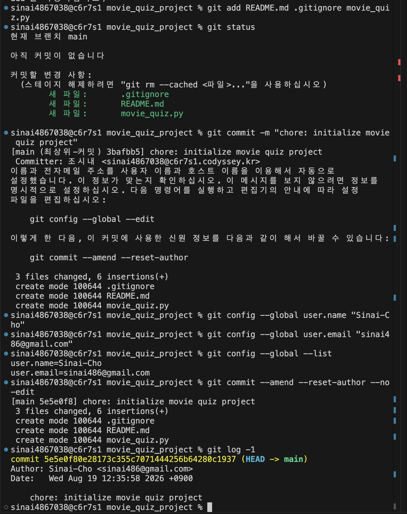
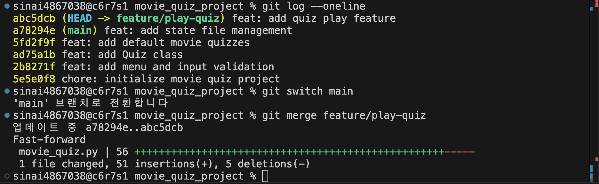
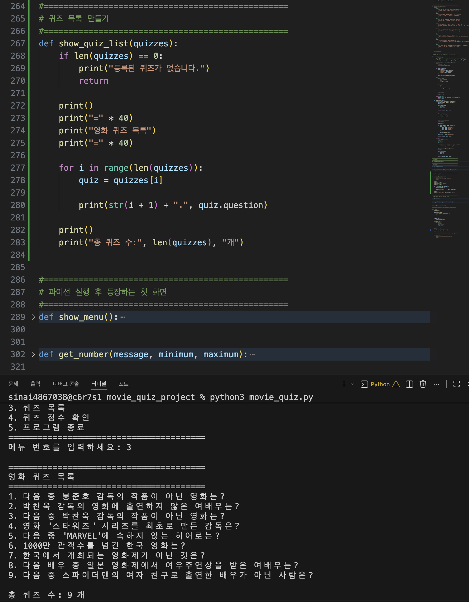
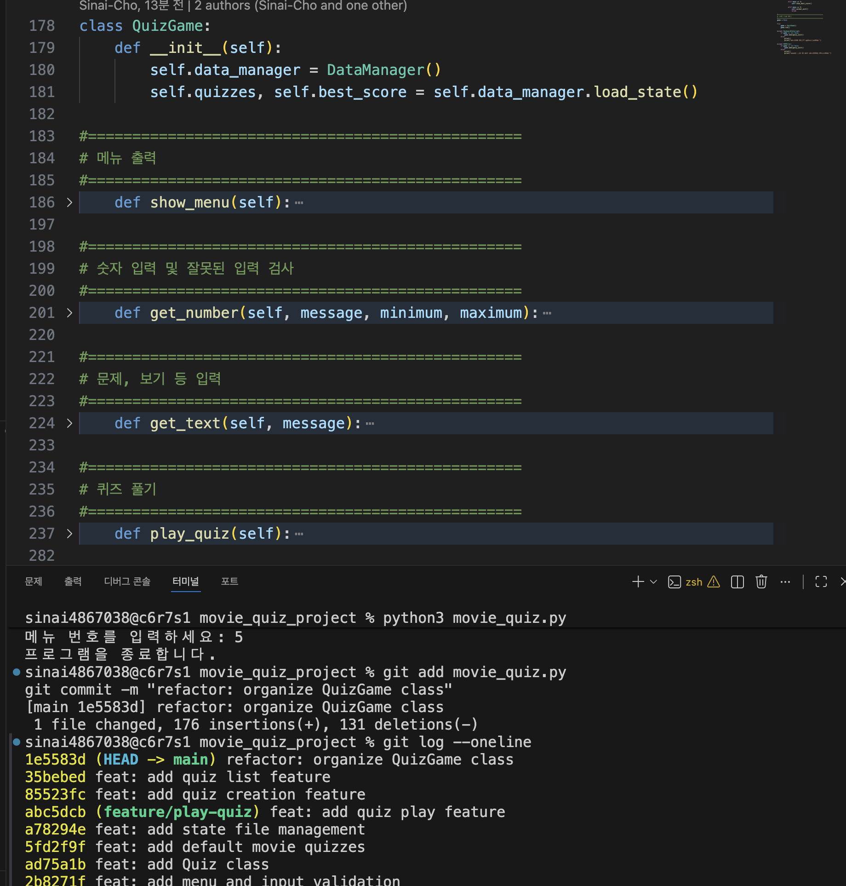
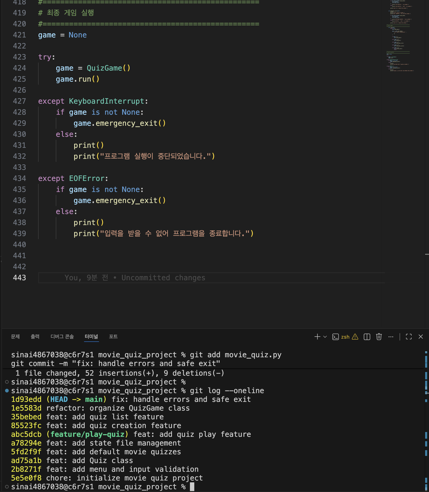
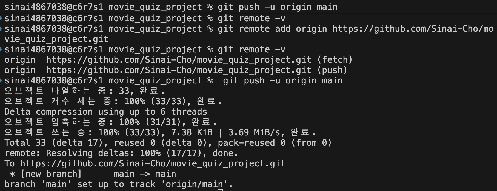
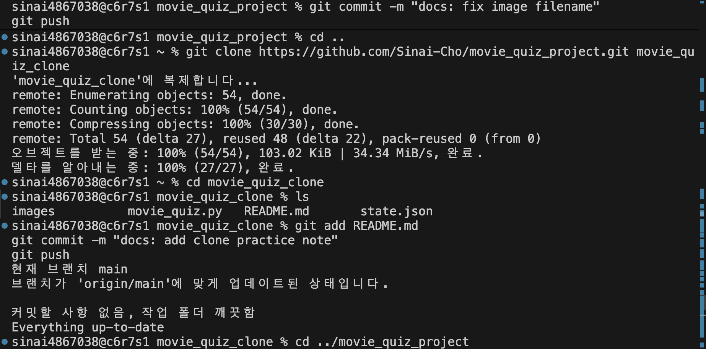
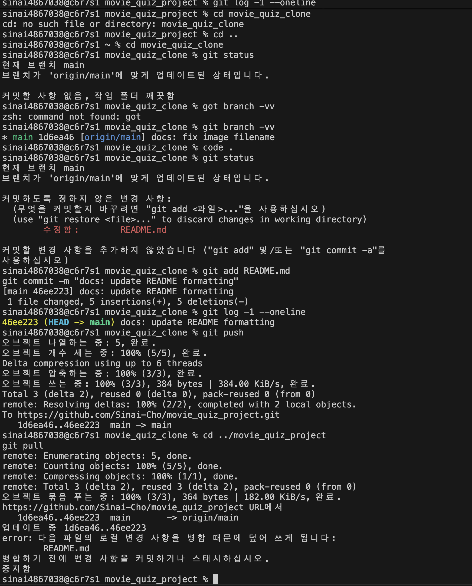

# 1.디렉토리 생성

. 

# 2. 커밋 기록

-  파일 생성

- 퀴즈 1개당 형식 지정

 

- 기본 퀴즈

-json 파일 저장 및 불러오기

- mergy

- 퀴즈 추가

- 퀴즈 목록

- 퀴즈 클래스로 정리

- 비정상 종료 처리

# 3. pusu / pull / clone 기록
## 1) push

## 2) clone and pull

## 3) clone 결과 (before, after)

